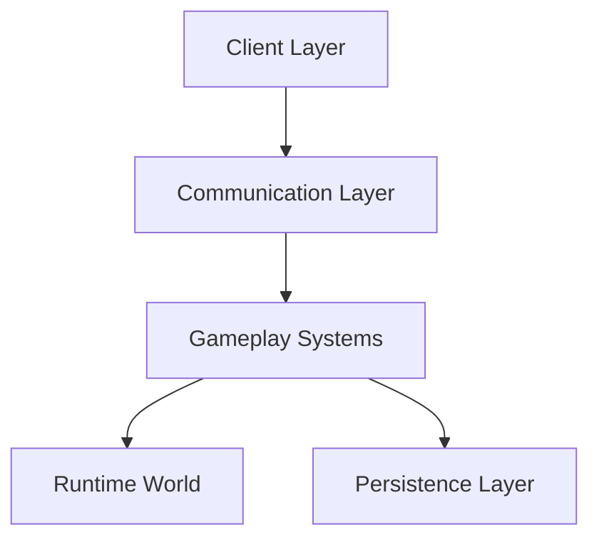
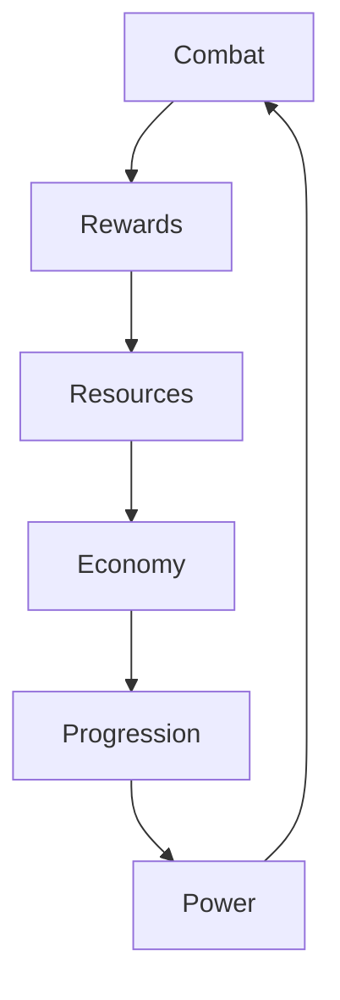

# Idle Boss Fighters

A modular server-authoritative gameplay architecture focused on persistent progression, scalable economies, runtime ownership and deterministic combat systems.

Idle Boss Fighters was designed as a technical exploration of long-term progression systems, world instancing, combat orchestration and player persistence.

---

# Overview

Idle Boss Fighters is an incremental combat experience built around isolated player environments, persistent progression and modular gameplay services.

The project explores several software engineering concepts commonly found in large-scale interactive systems.

Examples include:

- Server-authoritative gameplay
- Runtime ownership models
- Modular architecture
- Persistent player progression
- Infinite scaling systems
- Combat orchestration
- Reward pipelines
- Fault tolerance mechanisms
- Data-driven balancing

---

# Technical Highlights

- Server-authoritative architecture
- Modular gameplay services
- Persistent progression systems
- Runtime world instancing
- Data-driven configuration
- Infinite economy scaling
- Fault tolerant runtime systems
- Bidirectional client-server communication
- State driven combat design

---

# Architecture



---

# Core Systems

| System | Responsibility | Technical Value |
|--------|----------------|-----------------|
| GameManager | Coordinates runtime systems and progression | Central orchestration |
| CombatDirector | Controls combat states and combat flow | Stateful simulation |
| GameLoop | Handles recurring gameplay execution | Runtime coordination |
| PlayerData | Stores persistent progression | Persistence model |
| BigNum | Supports indefinite scaling | Numerical abstraction |
| QuestService | Handles progression objectives | Retention mechanics |
| DealerSystem | Controls cosmetic rotation | Reward systems |
| NPCHandler | Maintains world entities | Runtime management |
| AnalyticsService | Tracks gameplay metrics | Product validation |

---

# Gameplay Loop



---

# Runtime Architecture

Each player owns an isolated gameplay environment.

Dedicated runtime instances contain:

- NPC team
- Boss entity
- Progression systems
- Reward generation
- Upgrade systems
- Cosmetic systems
- Runtime references

This approach simplifies ownership boundaries, persistence and world synchronization.

---

# Networking Principles

Idle Boss Fighters follows several architectural principles.

### Server Authority

Critical gameplay decisions remain server-side.

Examples:

- Combat
- Rewards
- Purchases
- Progression
- Save operations

---

### Separation of Responsibilities

Systems remain isolated according to their domain.

Examples:

- CombatDirector
- QuestService
- DealerSystem
- AnalyticsService
- BigNum

---

### Fault Tolerance

Recovery systems exist to mitigate runtime anomalies.

Examples:

- SafeZone
- NPC validation
- Position correction
- Runtime recovery

---

### Infinite Scalability

Progression systems support indefinite growth.

Examples:

- BigNum
- Config-driven balancing
- Multipliers
- Upgrade systems

---

# Documentation

Detailed documentation can be found inside the `docs/` directory.

Available documents:

- architecture.md
- client-server.md
- combat-system.md
- economy-system.md
- plot-system.md
- module-responsibilities.md

---

# Repository Structure

```text
idle-boss-fighters/

README.md

docs/
├── architecture.md
├── client-server.md
├── combat-system.md
├── economy-system.md
├── plot-system.md
└── module-responsibilities.md

code-samples/
├── GameManager.sample.lua
├── CombatDirector.sample.lua
├── BigNum.sample.lua
└── PlayerData.sample.lua

assets/
├── screenshots/
└── diagrams/
```

---

# Engineering Focus

This repository was created as a technical case study demonstrating:

- Software architecture
- Gameplay systems engineering
- Runtime simulation
- Persistence design
- Modular services
- Economy design
- Combat orchestration
- Distributed ownership models
- Data-driven systems
- Scalable progression
