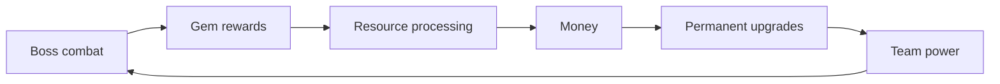
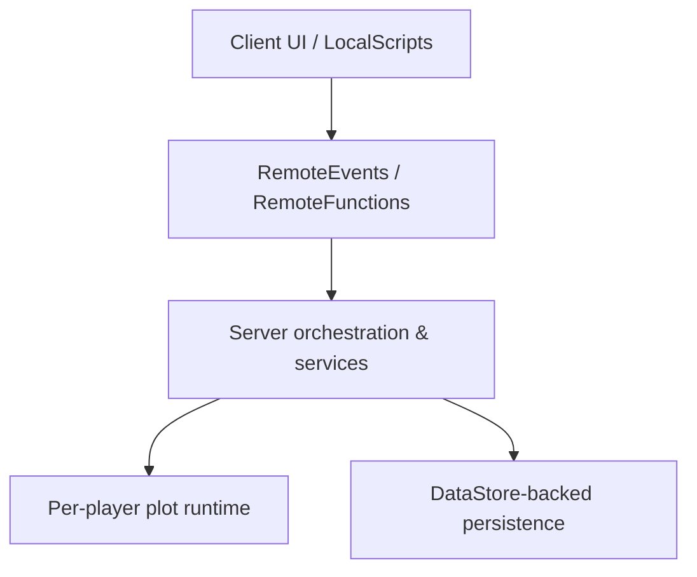
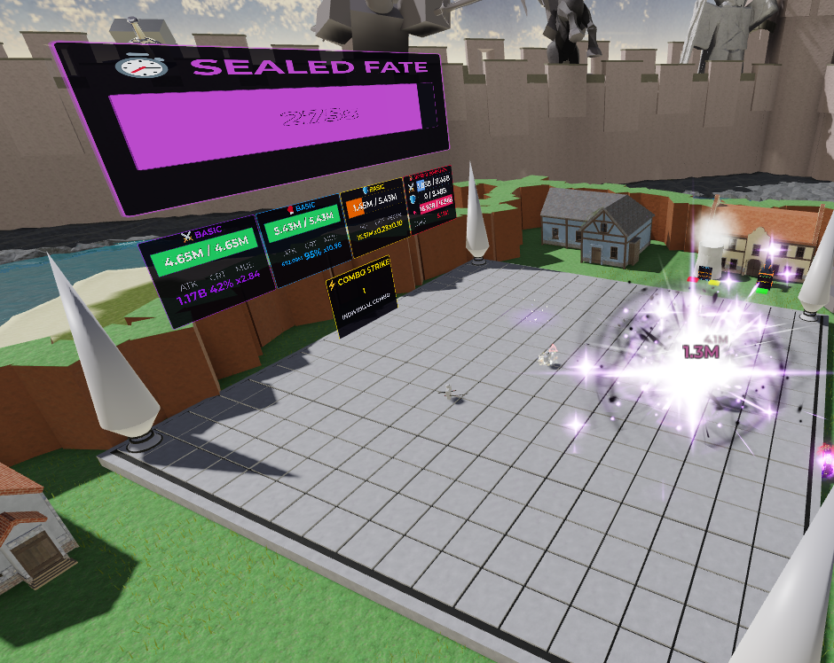
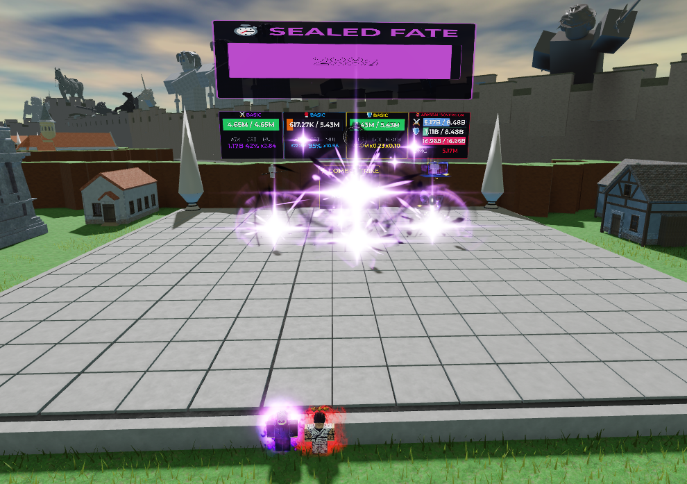
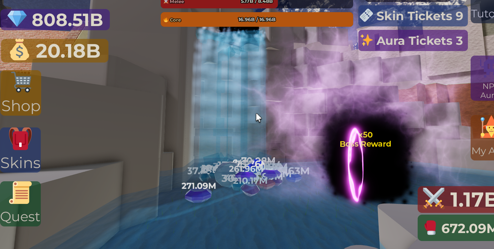
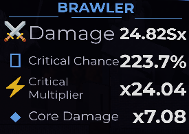
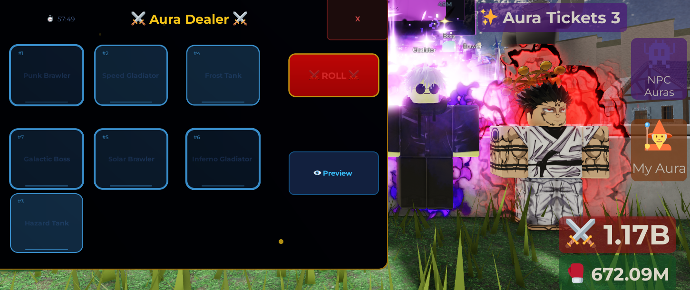
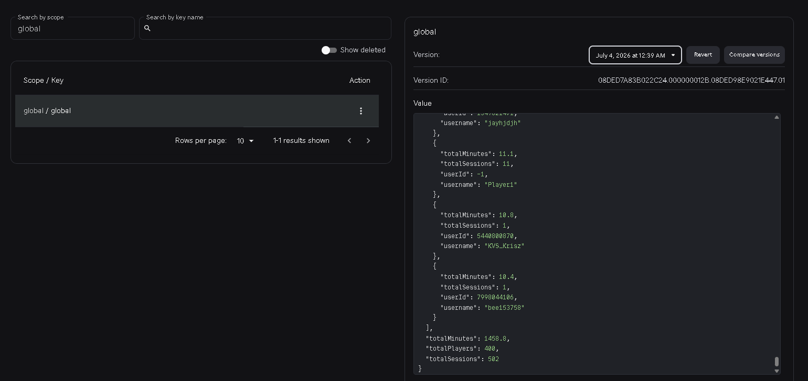
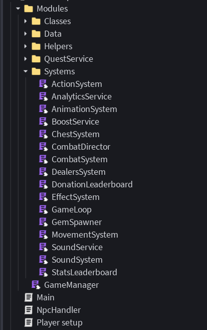

# Idle Boss Fighters

> Server-authoritative Roblox auto-battler focused on persistent progression, per-player runtime ownership, large-number economy systems, and combat orchestration.

Idle Boss Fighters is a completed Roblox/Luau portfolio project built around an incremental combat loop: a player-owned NPC team fights bosses, earns resources, processes those resources into currency, and reinvests that currency into permanent progression.

This repository is a **curated technical portfolio**, not a full Roblox place export. It contains representative Luau code, architecture documentation, Mermaid diagrams, and screenshots that explain the systems behind the project.

---

## Engineering Highlights

- **Server-authoritative progression** for combat, rewards, purchases, and persistent state.
- **Per-player plot ownership** using explicit runtime ownership metadata.
- **State-driven combat orchestration** with shield/core boss phases, turn coordination, combos, and timeout handling.
- **Extended-range numeric model** (`BigNum`) based on mantissa/exponent representation for incremental values beyond normal floating-point magnitude.
- **Persistent player profiles** with serialization, DataStore-backed saves, save throttling, offline progression, and backward-compatible defaults.
- **Defensive runtime recovery** for missing entities and physics-related position errors.
- **Data-driven balancing** through centralized configuration and progression formulas.
- **Session telemetry** stored separately from gameplay progression data.

---

## Core Gameplay Loop



The game is intentionally systems-driven rather than input-heavy. Progress comes from managing the economy and improving a persistent combat team.

---

## Architecture



### Client

The client handles presentation, input, UI state, effects, and local feedback.

### Server

The server owns authoritative combat, progression, reward, purchase, quest, and persistence operations. Client requests cross a RemoteEvent/RemoteFunction boundary before server-side systems modify gameplay state.

### Runtime ownership

Players are assigned one of the available plots in `workspace.Plots`. A plot records its owner through attributes and becomes the boundary for that player's boss, NPCs, processor, upgrade stations, and other runtime references.

This is **plot allocation**, not separate Roblox server instancing: server capacity is bounded by the number of configured plots.

### Persistence

`PlayerData` models the persistent player profile. Runtime values are serialized into DataStore-safe structures, while `GameManager` coordinates loading, saving, save throttling, and shutdown persistence.

---

## Combat Model

Combat is coordinated by `CombatDirector` and progresses through explicit states:

```text
Shield phase
   ↓
Core phase
   ↓
Victory / defeat / timeout
   ↓
Reset / next boss
```

Turn order and state transitions are explicit, while selected mechanics such as target choice, shield formation, and combo activation use probability. The system is therefore **state-driven, not fully deterministic**.

Representative sample: [`CombatDirector.sample.lua`](code-samples/CombatDirector.sample.lua)

---

## Large-Number Progression

The economy uses a custom `BigNum` representation:

```text
value = mantissa × 10^exponent
```

This lets progression values exceed the magnitude that can be represented directly as ordinary Roblox numbers.

The implementation is optimized for the project's non-negative incremental economy. It is **not an arbitrary-precision mathematics library**: it deliberately discards insignificant values across large exponent gaps and uses native floating-point mantissas.

Representative sample: [`BigNum.sample.lua`](code-samples/BigNum.sample.lua)

---

## Persistence and Profile Evolution

The player profile includes:

- currency and processing queues;
- combat and upgrade statistics;
- boss progression;
- skins and auras;
- quests and titles;
- boosts and gamepasses;
- tutorial state;
- offline progression inputs.

Deserialization fills missing fields with defaults so older records can continue to load as the profile shape evolves.

Representative samples:

- [`PlayerData.sample.lua`](code-samples/PlayerData.sample.lua)
- [`GameManager.sample.lua`](code-samples/GameManager.sample.lua)

---

## Runtime Recovery

Two defensive mechanisms are represented in the samples:

- `GameManager` periodically verifies critical NPC/boss references and recreates missing runtime entities.
- `SafeZone` checks whether combat models move outside the expected plot area and repositions them while clearing accumulated physics velocity.

These mechanisms improve runtime resilience, but they are intentionally described as **recovery guards**, not general distributed fault-tolerance guarantees.

Representative sample: [`SafeZone.sample.lua`](code-samples/SafeZone.sample.lua)

---

## Selected Code Samples

| Sample | What it demonstrates |
|---|---|
| [`GameManager.sample.lua`](code-samples/GameManager.sample.lua) | Player lifecycle, DataStore load/save, save throttling, battle loops, runtime recovery, remote boundaries |
| [`PlayerData.sample.lua`](code-samples/PlayerData.sample.lua) | Persistent profile model, economy state, upgrades, serialization, compatibility defaults, offline progression |
| [`CombatDirector.sample.lua`](code-samples/CombatDirector.sample.lua) | State-driven combat flow, probabilistic targeting/combos, shield/core phases, timeout resolution |
| [`BigNum.sample.lua`](code-samples/BigNum.sample.lua) | Mantissa/exponent arithmetic, comparisons, serialization, formatting |
| [`PlotManager.sample.lua`](code-samples/PlotManager.sample.lua) | Plot allocation, owner lookup, spatial ownership resolution, cleanup |
| [`AnalyticsService.sample.lua`](code-samples/AnalyticsService.sample.lua) | Session tracking, bounded history, persistent telemetry |
| [`SafeZone.sample.lua`](code-samples/SafeZone.sample.lua) | Position validation and physics recovery |

The samples are intentionally incomplete and reference modules/assets that are not included in this portfolio repository.

---

## Screenshots

### Player Runtime



### Combat



### Economy and Processing



### Progression



### Cosmetic Dealers



### Session Analytics



### Project Structure



---

## Documentation

| Document | Focus |
|---|---|
| [`docs/architecture.md`](docs/architecture.md) | System boundaries, orchestration, persistence, and architectural trade-offs |
| [`docs/client-server.md`](docs/client-server.md) | Authority boundaries and remote communication |
| [`docs/combat-system.md`](docs/combat-system.md) | Combat states, randomness, turn coordination, and result resolution |
| [`docs/economy-system.md`](docs/economy-system.md) | Resource loop, BigNum model, upgrades, and persistence |
| [`docs/plot-system.md`](docs/plot-system.md) | Plot allocation, ownership, runtime capacity, and recovery |
| [`docs/module-responsibilities.md`](docs/module-responsibilities.md) | Responsibility map for the main systems |

Editable Mermaid sources are under [`assets/diagrams/`](assets/diagrams/).

---

## Repository Structure

```text
Idle-Boss-Fighters/
├── README.md
├── code-samples/
│   ├── AnalyticsService.sample.lua
│   ├── BigNum.sample.lua
│   ├── CombatDirector.sample.lua
│   ├── GameManager.sample.lua
│   ├── PlayerData.sample.lua
│   ├── PlotManager.sample.lua
│   └── SafeZone.sample.lua
├── docs/
│   ├── README.md
│   ├── architecture.md
│   ├── client-server.md
│   ├── combat-system.md
│   ├── economy-system.md
│   ├── module-responsibilities.md
│   └── plot-system.md
└── assets/
    ├── diagrams/
    └── screenshots/
```

---

## Design Trade-offs and Limitations

This project was built as a Roblox game, not as distributed backend infrastructure. Important boundaries include:

- `GameManager` is a central coordinator and therefore a deliberate coupling point.
- Plot capacity is bounded by the preconfigured plots available in each server.
- Persistence depends on Roblox `DataStoreService`; the repository does not include a dedicated automated test suite for persistence failure scenarios.
- Runtime recovery loops repair known entity/physics problems but do not provide general fault tolerance.
- Combat contains random mechanics, so battle sequences are not deterministic.
- `BigNum` extends numeric range for incremental progression but does not provide arbitrary precision.
- The repository contains curated code excerpts rather than a standalone buildable Roblox place.

These constraints are part of the portfolio documentation because they describe the actual engineering boundaries of the implementation.

---

## Project Status

**Completed / archived portfolio project.**

The game reached a playable release state and is no longer under active feature development. The repository is maintained as a technical record of the architecture, gameplay systems, persistence model, and engineering lessons from the project.

---

## Tech Stack

```text
Platform: Roblox
Language: Luau
Persistence: Roblox DataStoreService
Networking: RemoteEvents / RemoteFunctions
Runtime: Roblox server/client model
Documentation: Markdown + Mermaid
```

## Author

Developed by **Pval-Dev**.
