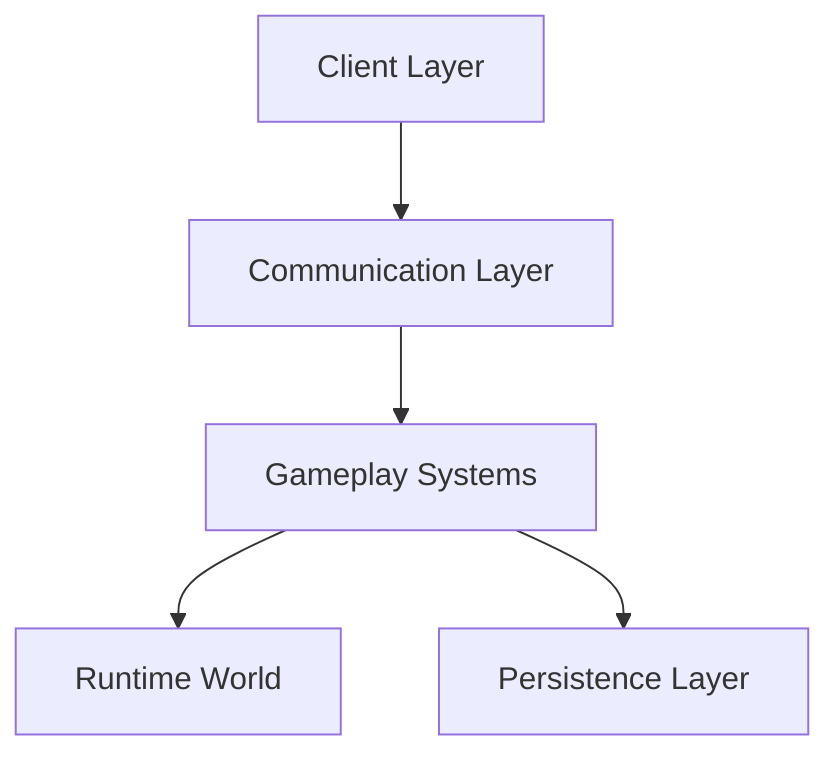
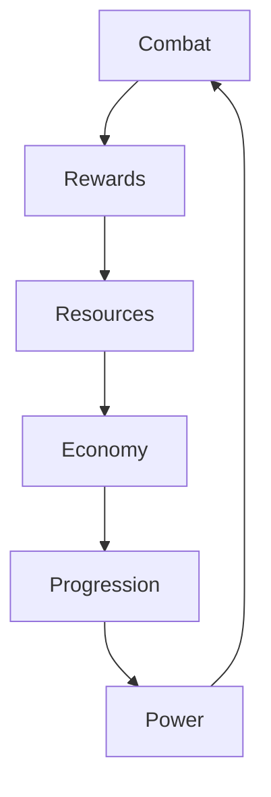

# Idle Boss Fighters

> Modular runtime architecture for persistent progression, isolated world ownership and scalable combat systems.

Idle Boss Fighters is a technical portfolio project focused on gameplay orchestration, persistence design, runtime simulation and infinite economy systems.

---

# Project Goals

This project was designed to explore software engineering concepts frequently found in persistent online experiences.

Primary objectives:

- Design a server-authoritative gameplay architecture
- Implement isolated runtime ownership models
- Support infinite numerical progression
- Create fault tolerant runtime systems
- Build deterministic combat orchestration
- Develop persistent player progression pipelines

---

# Overview

Idle Boss Fighters is an incremental combat experience built around isolated player environments, persistent progression and modular gameplay services.

The project explores several engineering concepts commonly found in large-scale interactive systems.

Examples include:

- Server-authoritative gameplay
- Runtime ownership models
- Modular architecture
- Persistent progression
- Infinite scaling systems
- Combat orchestration
- Reward pipelines
- Fault tolerance mechanisms
- Data-driven balancing

---

# Technical Highlights

- Server-authoritative architecture
- Runtime world instancing
- Persistent progression systems
- Infinite numerical scaling
- Data-driven balancing
- Combat state orchestration
- Modular gameplay services
- Fault tolerant recovery systems
- Analytics and telemetry collection
- Ownership-based world simulation

---

# Architecture



Additional architectural diagrams are available inside:

```text
diagrams/
```

---

# Core Systems

| Category | System | Responsibility | Technical Value |
|----------|--------|----------------|-----------------|
| Core | GameManager | Runtime orchestration | Lifecycle management |
| Core | CombatDirector | Combat state machine | Stateful simulation |
| Core | GameLoop | Continuous gameplay execution | Runtime coordination |
| Data | PlayerData | Persistent player model | Persistence design |
| Data | Config | Data-driven balancing | System configuration |
| Economy | BigNum | Infinite progression support | Numerical abstraction |
| Services | QuestService | Progression objectives | Retention mechanics |
| Services | DealerSystem | Cosmetic rotation | Reward systems |
| Services | AnalyticsService | Product telemetry | Market validation |
| Runtime | PlotManager | World ownership | Instance allocation |
| Runtime | SafeZone | Entity recovery | Fault tolerance |

---

# Gameplay Loop



---

# Runtime Architecture

The project adopts a player-owned runtime model where each user receives an isolated simulation environment.

Each runtime instance contains:

- NPC squad
- Boss controller
- Economy systems
- Upgrade systems
- Cosmetic services
- Analytics hooks
- Persistence references

This architecture reduces synchronization complexity and simplifies ownership validation.

---

# Design Principles

## Server Authority

Critical gameplay decisions remain server-side.

Examples:

- Combat
- Progression
- Rewards
- Purchases
- Persistence
- Save operations

---

## Separation of Concerns

Systems remain isolated according to their domain.

Examples:

- CombatDirector
- PlayerData
- DealerSystem
- QuestService
- AnalyticsService
- BigNum

---

## Ownership Model

Gameplay environments are dynamically assigned through runtime plot allocation.

Ownership determines:

- Reward distribution
- Entity references
- Progression scope
- Persistence boundaries
- Runtime recovery
- Validation rules

---

## Fault Tolerance

Recovery systems exist to mitigate runtime anomalies.

Examples:

- SafeZone
- NPC validation
- Position correction
- Runtime reconstruction
- Physics stabilization

---

## Infinite Progression

Progression systems support indefinite growth.

Examples:

- BigNum
- Config-driven balancing
- Multipliers
- Upgrade systems
- Scaling formulas

---

# Selected Implementations

Representative implementations can be found inside:

```text
code-samples/
```

Included samples:

- GameManager.sample.lua
- PlayerData.sample.lua
- CombatDirector.sample.lua
- BigNum.sample.lua
- PlotManager.sample.lua
- AnalyticsService.sample.lua
- SafeZone.sample.lua

---

# Documentation

Detailed documentation is available under:

```text
docs/
```

Included references:

- architecture.md
- client-server.md
- combat-system.md
- economy-system.md
- plot-system.md
- module-responsibilities.md

Architectural diagrams are available inside:

```text
diagrams/
```

---

# Screenshots

Work in progress.

Representative captures will include:

- Runtime plots
- Combat encounters
- Upgrade systems
- Economy interfaces
- Dealers
- Analytics systems
- Progression screens

---

# Engineering Lessons

This project explored several engineering challenges.

Examples include:

- Persistent state evolution
- Runtime ownership validation
- Numerical scaling limitations
- Fault recovery mechanisms
- Combat state coordination
- Service decomposition
- Data migration strategies
- Long-term progression design

---

# Repository Structure

```text
idle-boss-fighters/

README.md

docs/
├── architecture.md
├── client-server.md
├── combat-system.md
├── economy-system.md
├── plot-system.md
├── module-responsibilities.md

code-samples/
├── GameManager.sample.lua
├── PlayerData.sample.lua
├── CombatDirector.sample.lua
├── BigNum.sample.lua
├── PlotManager.sample.lua
├── AnalyticsService.sample.lua
└── SafeZone.sample.lua

diagrams/
├── architecture.mmd
├── client-server.mmd
├── economy-loop.mmd
├── combat-system.mmd
├── plot-system.mmd
├── persistence.mmd
├── analytics.mmd
├── progression-loop.mmd

assets/
└── screenshots/
```

---

# Future Work

Potential future iterations include:

- Event-driven combat systems
- ECS-inspired entity handling
- Distributed analytics aggregation
- Automated balancing tools
- Runtime diagnostics
- Gameplay instrumentation

---

# Portfolio Relevance

This repository demonstrates practical experience in:

- Software architecture
- Runtime simulation
- Persistence systems
- Gameplay engineering
- Numerical abstractions
- Fault tolerant systems
- Service-oriented design
- Data-driven balancing
- Ownership models
- Scalable progression systems
