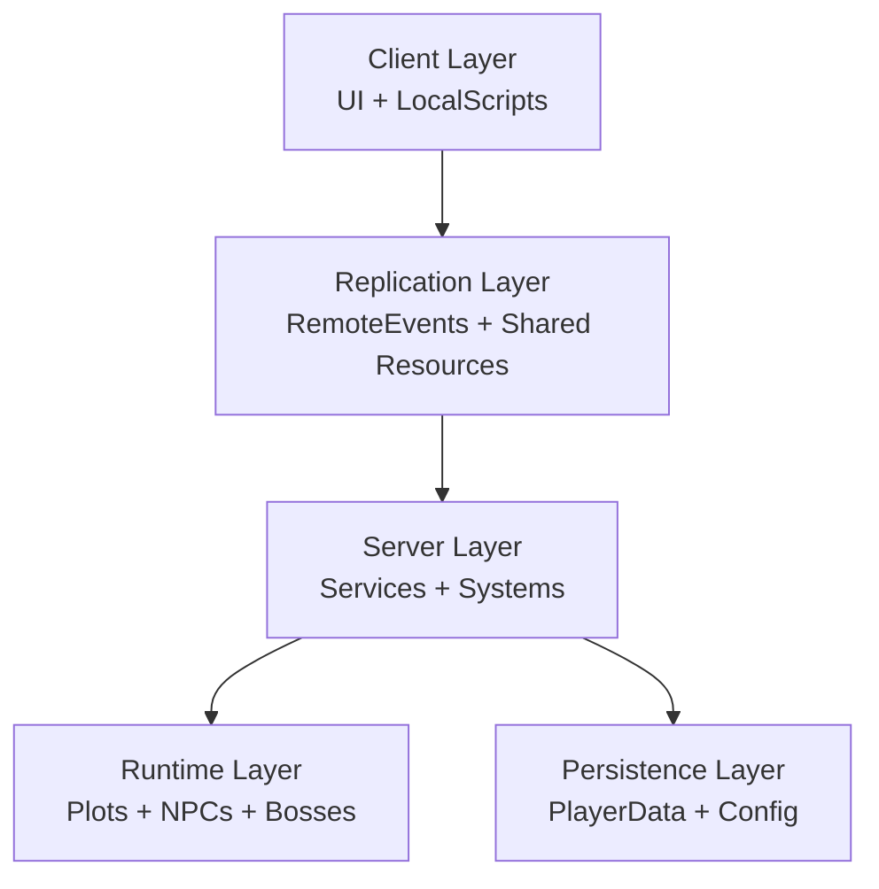
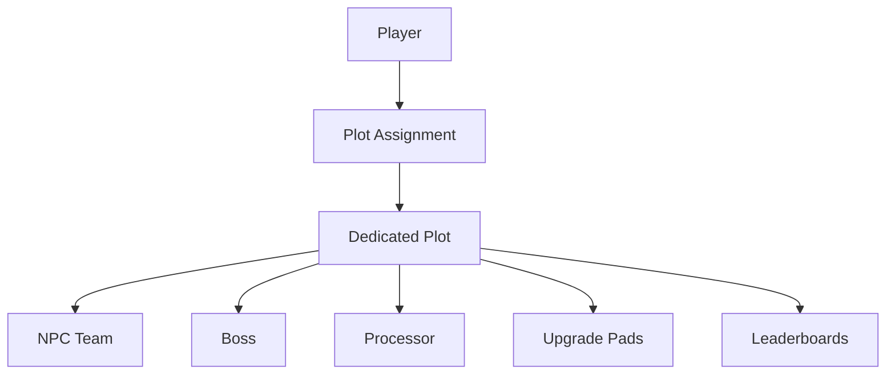

# Architecture

Idle Boss Fighters follows a modular server-authoritative architecture designed around separation of responsibilities, scalability, maintainability, and fault tolerance.

The project is structured into multiple layers responsible for gameplay orchestration, world simulation, persistence, networking, and client interaction.

---

# Architectural Overview

---

# Client Layer

The client layer is responsible for player interaction, interface rendering, visual feedback, and local presentation.

Components:

- HUD
- Tutorial
- Dealers Interface
- Inventory
- Aura Interfaces
- Quests UI
- Boost HUD
- ArenaClient
- GemNotificationListener
- DeathScreen

Responsibilities:

- Handle user input
- Present gameplay information
- Trigger client requests
- Display visual feedback
- Manage local effects

---

# Replication Layer

Shared resources are centralized inside ReplicatedStorage.

Main resources:

- PlayerRemotes
- Effects
- Gems
- NPC Templates
- Auras
- Tutorial Assets
- Arena Weapons
- PlayerAuras

Responsibilities:

- Shared assets distribution
- Client-server communication
- Replicated visual content
- Runtime synchronization

---

# Server Layer

The server owns all gameplay authority.

Core modules:

- GameManager
- GameLoop
- CombatDirector
- CombatSystem

Gameplay systems:

- ActionSystem
- AnimationSystem
- EffectSystem
- SoundSystem
- MovementSystem
- DealerSystem
- QuestService
- TitleService

Support services:

- AnalyticsService
- SafeZone
- DamageNumbersService

Responsibilities:

- Validate gameplay actions
- Execute combat logic
- Progress player economy
- Manage runtime systems
- Spawn rewards
- Handle progression
- Process purchases
- Coordinate save operations

---

# Runtime Layer

Each player receives a dedicated gameplay environment.

Responsibilities:

- Runtime entity ownership
- World synchronization
- Spatial isolation
- Player progression management
- Boss lifecycle management

---

# Persistence Layer

Persistent data is centralized around PlayerData.

Components:

- PlayerData
- Config
- QuestConfig
- TitleConfig
- AnimationData
- EffectData
- SoundData
- AuraData

Responsibilities:

- Serialization
- Deserialization
- Autosave
- Statistics persistence
- Economy persistence
- Cosmetic ownership
- Player progression storage

---

# Architectural Principles

Idle Boss Fighters follows several software engineering principles.

## Separation of Responsibilities

Systems are isolated according to their domain.

Examples:

CombatDirector

Responsible for battle phases.

QuestService

Responsible for progression objectives.

DealerSystem

Responsible for cosmetic rotation.

BigNum

Responsible for scalable numerical operations.

AnalyticsService

Responsible for gameplay telemetry.

---

## Server Authority

Critical gameplay decisions remain server-side.

Examples:

- Purchases
- Combat
- Reward distribution
- Progression updates
- Save operations

This prevents client manipulation and guarantees gameplay consistency.

---

## Data Driven Design

Most balancing values are centralized inside Config.

Examples:

- Upgrade costs
- Scaling curves
- Reward multipliers
- Combat parameters
- Quest requirements

This approach simplifies balancing and iteration.

---

## Fault Tolerance

Recovery systems exist to mitigate runtime anomalies.

Examples:

- SafeZone
- Runtime validation
- NPC repositioning
- Recovery mechanisms

---

## Scalability

Progression systems are designed for indefinite growth.

Examples:

- BigNum
- Config driven scaling
- Modular gameplay services
- Persistent progression systems
