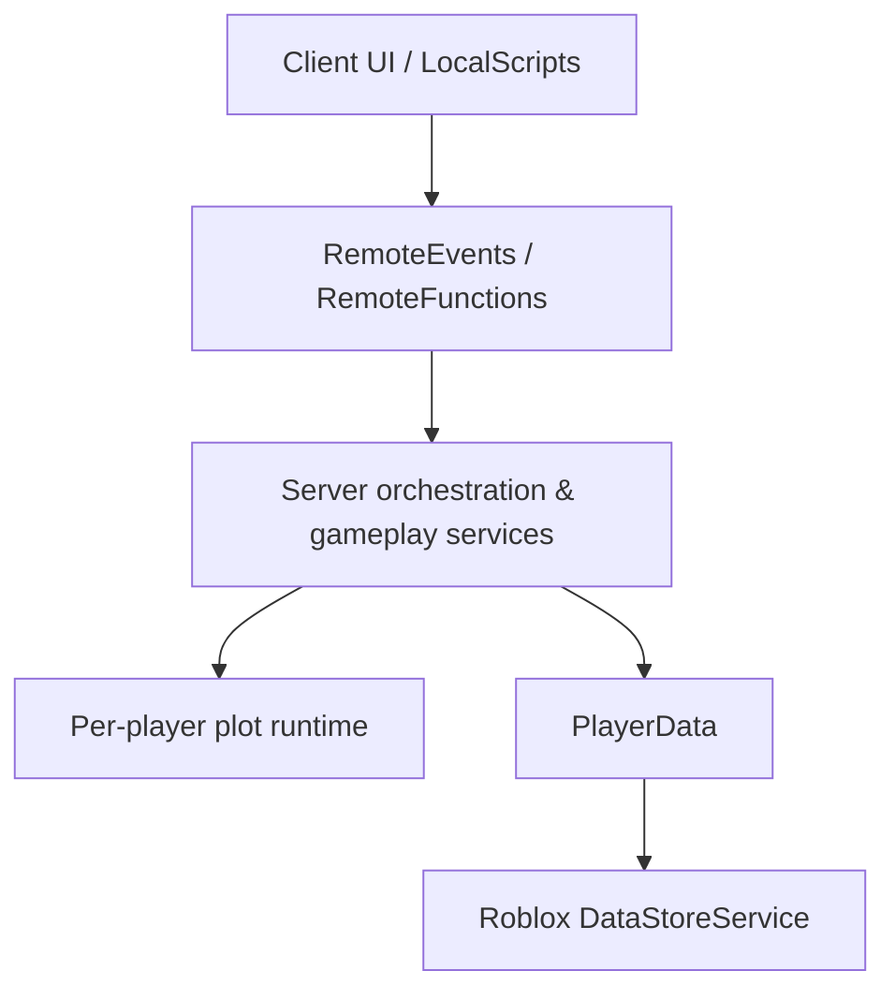

# Architecture

Idle Boss Fighters uses a server-authoritative Roblox architecture with three main concerns: client presentation, authoritative gameplay orchestration, and per-player runtime state backed by persistent player profiles.

This document describes the implemented boundaries and their trade-offs. The project is a Roblox game architecture, not distributed backend infrastructure.

---

## System Overview



## Client Layer

The client is responsible for presentation and interaction:

- HUD and inventory interfaces;
- tutorials and notifications;
- cosmetic and quest UI;
- local visual/audio feedback;
- camera and control behavior.

The client can request actions, but authoritative persistent state is modified by server-side systems.

## Communication Boundary

`RemoteEvents` and `RemoteFunctions` expose the client/server boundary.

Typical flow:

```text
UI interaction
→ LocalScript
→ RemoteEvent / RemoteFunction
→ server validation
→ gameplay service
→ authoritative state change
→ replicated/presentation update
```

This design reduces the amount of progression state that must be trusted from the client.

## Server Orchestration

`GameManager` coordinates several lifecycle concerns:

- plot assignment and release;
- profile loading and saving;
- battle-loop startup;
- processor and HUD loops;
- runtime entity recovery;
- selected remote handlers;
- shutdown persistence.

This central coordinator makes system startup and ownership easy to reason about, but it is also a coupling point. A larger version of the project would benefit from splitting persistence, session lifecycle, and remote request handling into smaller services.

## Gameplay Systems

Gameplay responsibilities are separated into modules such as:

- `CombatDirector` — combat phases and turn orchestration;
- `CombatSystem` — combat calculations and runtime interactions;
- `ActionSystem` — coordination of movement, animation, sound, and effects;
- `QuestService` — quest state and rewards;
- `DealerSystem` — rotating cosmetic offers and purchases;
- `TitleService` — title progression;
- `BigNum` — extended-range economy values.

The separation is practical rather than framework-heavy: modules communicate directly where the game needs tight runtime coordination.

## Per-Player Runtime Ownership

The world is divided into preconfigured plots. `PlotManager` assigns an unclaimed plot to a joining player and records ownership through attributes.

Each plot acts as the scope for:

- the player's NPC team;
- boss runtime;
- processor;
- upgrade stations;
- reward objects;
- cosmetic/dealer references.

This reduces cross-player reference ambiguity and makes ownership checks easier.

It is important to distinguish this from server instancing: all plots still exist inside the same Roblox server, and the number of concurrent player environments is bounded by the number of available plots.

## Persistence

`PlayerData` is the persistent profile model. It contains economy, combat progression, cosmetics, quests, titles, boosts, tutorial state, and related runtime values.

Serialization converts custom runtime values such as `BigNum` into plain tables suitable for DataStore storage.

`GameManager` handles:

- retrying reads/writes;
- save throttling;
- forced saves on leave;
- shutdown save attempts;
- offline progression calculation after loading.

The sample code demonstrates the persistence boundary but is not a complete production-grade persistence framework.

## Defensive Runtime Recovery

The project contains targeted recovery guards for common Roblox runtime problems:

- recreating missing NPC/boss entities;
- checking position bounds;
- clearing accumulated physics velocity;
- returning models to known-safe plot positions.

These are application-level recovery mechanisms. They should not be interpreted as general fault-tolerance or high-availability guarantees.

## Architectural Summary

The architecture emphasizes:

- server authority over progression;
- explicit player ownership boundaries;
- modular gameplay responsibilities;
- persistent player profiles;
- data-driven balancing;
- targeted runtime recovery.

The main trade-off is a deliberately centralized orchestration layer combined with platform-specific persistence and runtime assumptions.
