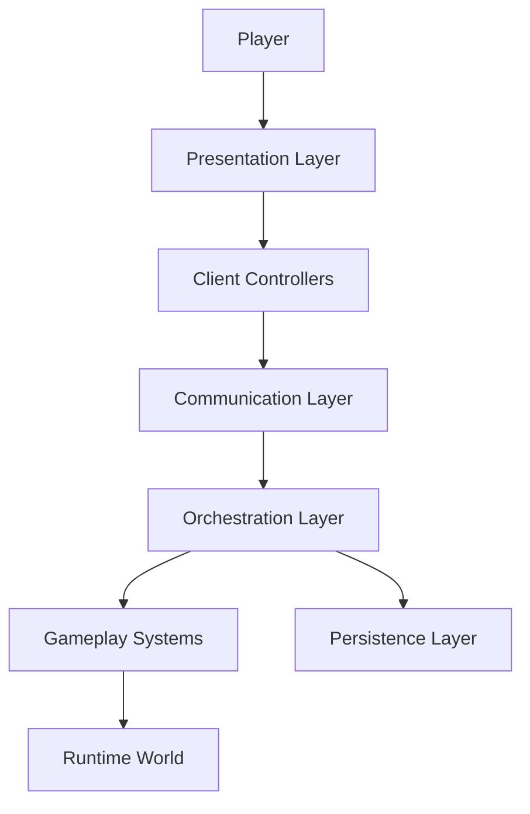

# Client-Server Architecture

Idle Boss Fighters follows a server-authoritative architecture designed around separation of responsibilities, maintainability, scalability and runtime consistency.

The client operates primarily as a presentation and interaction layer, while gameplay state ownership remains entirely server-side.

Critical systems such as progression, combat, persistence and reward distribution are executed and validated by the server.

---

# Communication Architecture

---

# Client Responsibilities

The client layer is responsible for user interaction, presentation and local visual feedback.

Examples include:

- HUD rendering
- Inventory interfaces
- Cosmetic interfaces
- Quest interfaces
- Tutorials
- Notifications
- Audio feedback
- Camera effects
- Visual indicators

Representative client-side controllers include:

- ArenaClient
- BoostHUD
- GemNotificationListener
- Donation
- DeathScreen
- LockControls
- Tutorial
- Inventory Interfaces

Responsibilities:

- Collect player input
- Present gameplay information
- Trigger gameplay requests
- Receive server updates
- Display visual feedback
- Handle local presentation concerns

The client does not own gameplay authority.

---

# Shared Resources Layer

Shared resources are centralized inside ReplicatedStorage.

Main categories include:

- Communication channels
- Shared assets
- Runtime templates
- Visual effects
- Cosmetic resources
- Interactive objects

Examples:

- PlayerRemotes
- Effects
- Gems
- Chests
- NPC Templates
- Tutorial Assets
- Auras
- Arena Weapons

Responsibilities:

- Asset replication
- Communication channel exposure
- Shared visual resources
- Runtime synchronization
- Cross-layer references

---

# Server Responsibilities

Critical gameplay systems remain server-side.

Examples include:

- Combat calculations
- Progression updates
- Save operations
- Reward distribution
- Purchase validation
- Quest tracking
- Ownership verification
- Runtime entity management

Core orchestration modules:

- GameManager
- CombatDirector
- CombatSystem
- GameLoop

Gameplay services:

- QuestService
- DealerSystem
- TitleService
- SoundSystem
- AnimationSystem
- EffectSystem
- MovementSystem

Support systems:

- AnalyticsService
- DamageNumbersService
- SafeZone

Responsibilities:

- Validate requests
- Execute gameplay logic
- Coordinate progression
- Maintain runtime consistency
- Manage persistence
- Synchronize world state

---

# Request Validation

Player requests are validated before modifying gameplay state.

Examples include:

- Purchase validation
- Upgrade validation
- Ownership verification
- Reward verification
- Quest completion checks
- Cosmetic equip operations

This approach prevents client manipulation and preserves gameplay consistency.

Examples of protected systems include:

- Progression
- Economy
- Inventory ownership
- Rewards
- Combat interactions

---

# Networking Principles

Idle Boss Fighters follows several networking principles.

---

## Presentation Layer

The client is responsible for presentation, user interaction and visual feedback.

Gameplay state ownership remains entirely server-side.

Examples:

- User interfaces
- Notifications
- Audio feedback
- Camera systems
- Visual indicators

---

## Server Authority

Critical operations are executed exclusively on the server.

Examples:

- Purchases
- Rewards
- Progression
- Save operations
- Combat calculations

This guarantees deterministic gameplay behavior and prevents state inconsistencies.

---

## Shared Resources

Shared resources are exposed through a centralized replication layer.

Examples:

- RemoteEvents
- RemoteFunctions
- Visual assets
- Runtime templates
- Cosmetic resources

---

## Bidirectional Communication

Communication occurs through RemoteEvents and RemoteFunctions.

RemoteEvents are primarily used for asynchronous communication.

RemoteFunctions are used for synchronous requests that require an immediate response.

Requests travel from the client layer towards gameplay systems.

Validated responses update the presentation layer.

---

# Architectural Benefits

This architecture provides several advantages.

- Separation of responsibilities
- Scalability
- Maintainability
- Runtime consistency
- Fault tolerance
- Improved debuggability
- Reduced coupling between systems
- Clear ownership boundaries
