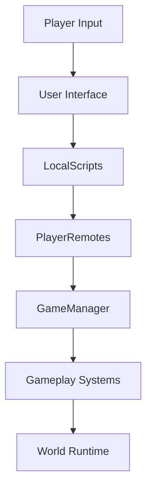

# Client - Server Architecture

Idle Boss Fighters follows a server-authoritative architecture where critical gameplay decisions are executed exclusively on the server.

The client acts primarily as a presentation and interaction layer while the server remains responsible for gameplay validation, progression, persistence and world simulation.

---

# Communication Flow

---

# Client Responsibilities

The client layer focuses on user experience and local presentation.

Examples:

- HUD rendering
- Inventory interfaces
- Dealer interfaces
- Aura interfaces
- Tutorial systems
- Quest interfaces
- Notifications
- Visual feedback
- Sound playback
- Camera effects

LocalScripts present in the project include:

- ArenaClient
- BoostHUD
- GemNotificationListener
- Donation
- DeathScreen
- LockControls
- Tutorial
- Inventory interfaces

Responsibilities:

- Capture user interactions
- Display information
- Send requests to server
- Receive server responses
- Manage local visual effects

---

# Shared Layer

Shared resources are centralized inside ReplicatedStorage.

Main folders:

- PlayerRemotes
- Effects
- Gems
- Chests
- NPC Templates
- Tutorial Assets
- Auras
- ArenaWeapons

Responsibilities:

- Replicate resources
- Centralize communication
- Expose visual assets
- Maintain synchronized references

---

# Server Responsibilities

Critical logic is executed on the server.

Examples:

- Combat calculations
- Progression
- Save operations
- Reward distribution
- Purchases
- Quest updates
- Cosmetic ownership
- Boss spawning

Core modules involved:

- GameManager
- CombatDirector
- CombatSystem
- GameLoop
- QuestService
- DealerSystem
- TitleService

---

# Request Validation

Player requests are validated before modifying gameplay state.

Examples:

- Purchase validation
- Upgrade validation
- Quest completion checks
- Reward claims
- Cosmetic equip operations

This prevents client manipulation and preserves gameplay consistency.

---

# Networking Principles

Idle Boss Fighters follows several networking principles.

## Thin Client

The client only requests actions.

It does not own gameplay authority.

---

## Server Authority

The server validates every critical operation.

Examples:

- Purchases
- Rewards
- Progression
- Saves
- Combat

---

## Shared Assets

ReplicatedStorage contains shared resources accessible to both client and server.

Examples:

- Remotes
- Effects
- Templates
- Cosmetic assets

---

## Bidirectional Communication

Communication occurs through RemoteEvents and RemoteFunctions.

Player requests travel from the client to the server.

Server responses update the client presentation layer.
flowchart TD

Player["Player"]

Client["Client Layer"]

Local["LocalScripts"]

Remote["PlayerRemotes"]

Manager["GameManager"]

Systems["Systems"]

World["World"]

Player --> Client

Client --> Local

Local --> Remote

Remote --> Manager

Manager --> Systems

Systems --> World
