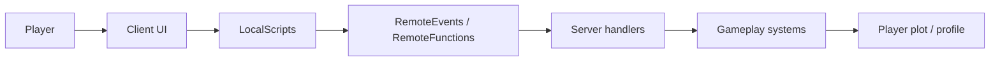

# Client-Server Architecture

Idle Boss Fighters treats the Roblox server as the authority for persistent progression and combat outcomes, while clients focus on interaction and presentation.

---

## Communication Flow



## Client Responsibilities

Client-side code handles concerns such as:

- input and interface interaction;
- HUD, inventory, quest, cosmetic, and tutorial presentation;
- notifications;
- local audio/visual feedback;
- camera and control effects.

Clients may request operations, but they are not the source of truth for persistent economy or combat state.

## Server Responsibilities

Server-side systems are responsible for authoritative changes such as:

- combat calculations and battle progression;
- currency and reward changes;
- upgrade and purchase handling;
- quest progression;
- inventory/cosmetic ownership;
- profile persistence;
- plot ownership and runtime entity management.

## Remote Boundary

`RemoteEvents` are used for asynchronous client/server messages. `RemoteFunctions` are used when a client needs a synchronous response.

The important architectural rule is not the transport itself, but the trust boundary:

```text
client request ≠ authorized state change
```

The server resolves the requesting player, loads the corresponding runtime/profile state, validates the requested operation, and only then mutates authoritative data.

## Server Authority: What It Does and Does Not Mean

Keeping progression authority on the server reduces common client-tampering risks because the client cannot simply declare a new balance, reward, or combat result.

It does **not** make the game automatically exploit-proof. Every exposed remote still needs input validation, ownership checks, rate/abuse considerations, and safe failure behavior.

## Replicated Resources

`ReplicatedStorage` contains shared resources that both sides need to reference, including:

- remotes;
- visual assets;
- templates;
- effects;
- cosmetic resources.

Shared visibility does not imply shared authority. Sensitive state changes remain server-side.

## Design Trade-offs

The architecture favors a straightforward Roblox service/module model over a custom networking framework.

Benefits:

- clear trust boundary;
- direct integration with Roblox replication;
- simple debugging of request flow;
- explicit ownership through the player's profile and plot.

Trade-offs:

- some request handling is coordinated through `GameManager`;
- validation quality depends on each server handler;
- the repository contains representative samples rather than every production remote.
