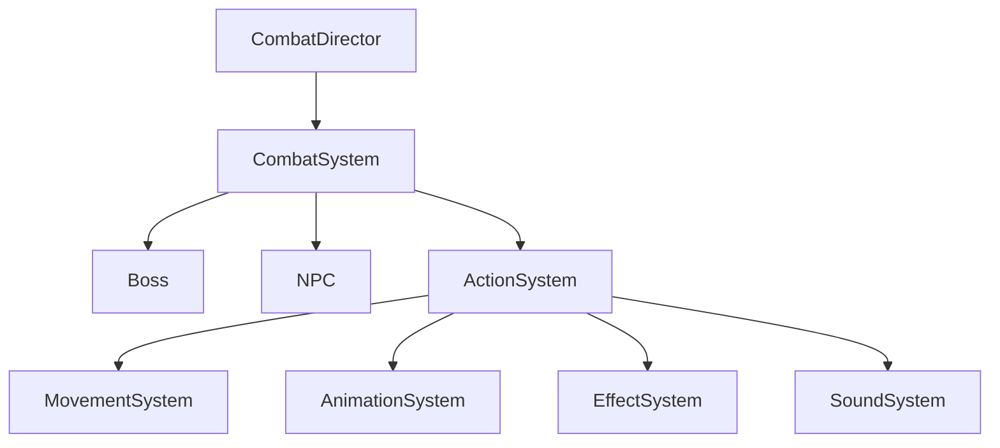
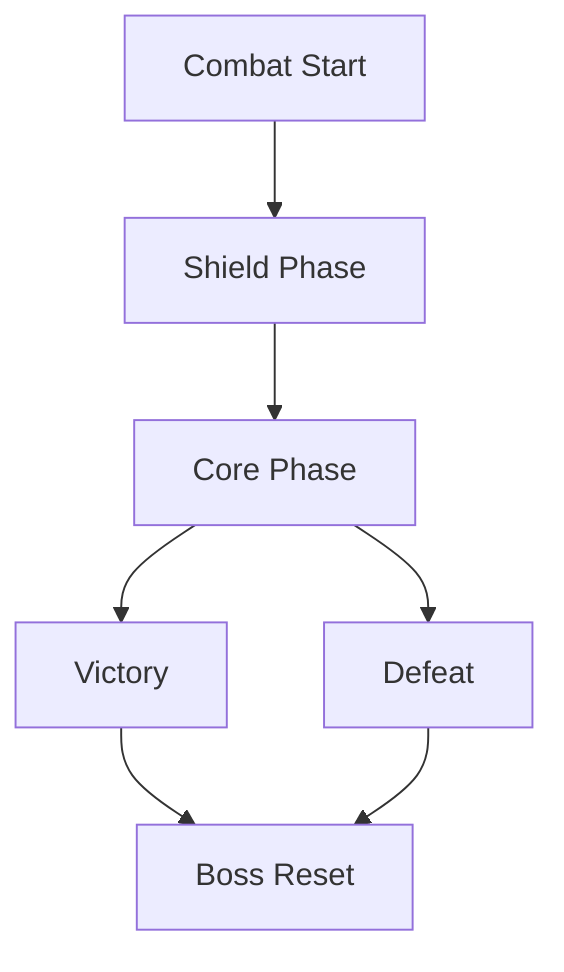

# Combat System

Idle Boss Fighters implements a modular combat architecture designed around state transitions, combat orchestration, runtime coordination and scalable progression.

Combat is executed entirely server-side and follows a deterministic flow to ensure gameplay consistency and progression integrity.

---

# System Overview

---

# Combat Flow

Combat is organized into several phases.

---

# CombatDirector

CombatDirector acts as the primary combat orchestrator.

Responsibilities:

- Control combat state
- Manage phase transitions
- Coordinate turn execution
- Validate combat flow
- Detect victory conditions
- Detect defeat conditions
- Trigger reward distribution
- Coordinate runtime resets

Technical Value:

- Stateful simulation
- Runtime coordination
- Centralized combat orchestration
- Domain separation

---

# CombatSystem

CombatSystem contains gameplay execution logic.

Responsibilities:

- Damage calculations
- Critical strikes
- Combo resolution
- Damage modifiers
- Shield interactions
- Core damage
- Regeneration
- Aggro calculations

Technical Value:

- Encapsulated gameplay logic
- Deterministic calculations
- Scalable balancing
- Independent combat execution

---

# Boss Architecture

Bosses operate through multiple combat states.

Examples:

- Shield Phase
- Core Phase
- Regeneration
- Reset State

Responsibilities:

- Shield management
- Core health management
- State transitions
- Combat interaction

Technical Value:

- Finite state management
- Runtime entity control
- Domain encapsulation

---

# NPC Architecture

NPC entities represent combat participants.

Examples:

- Gladiator
- Brawler
- ShieldMan

Responsibilities:

- Execute attacks
- Receive damage
- Participate in combo systems
- Support combat phases

Technical Value:

- Runtime entity abstraction
- Reusable combat objects
- Modular entity construction

---

# ActionSystem

ActionSystem coordinates gameplay execution between independent subsystems.

Responsibilities:

- Trigger movement
- Trigger animations
- Trigger sounds
- Trigger effects
- Coordinate combat feedback

Connected Systems:

- MovementSystem
- AnimationSystem
- EffectSystem
- SoundSystem

Technical Value:

- Decoupled execution
- Improved maintainability
- Reduced subsystem dependencies

---

# Combat Principles

Idle Boss Fighters follows several combat principles.

---

## State Driven Design

Combat progresses through explicit states.

Examples:

- Shield Phase
- Core Phase
- Victory
- Defeat

Benefits:

- Predictable behavior
- Easier debugging
- Reduced complexity

---

## Server Authority

Combat calculations remain server-side.

Examples:

- Damage
- Rewards
- Progression
- Combo execution
- Critical calculations

Benefits:

- Gameplay consistency
- Cheat prevention
- Reliable progression

---

## Runtime Coordination

Combat systems are synchronized through CombatDirector.

Benefits:

- Centralized control
- Clear ownership boundaries
- Easier maintenance

---

## Modularity

Combat responsibilities are distributed across independent systems.

Examples:

- CombatDirector
- CombatSystem
- ActionSystem
- MovementSystem
- AnimationSystem
- EffectSystem
- SoundSystem

Benefits:

- Scalability
- Extensibility
- Separation of responsibilities

---

# Architectural Benefits

The combat architecture provides:

- Deterministic combat flow
- Independent subsystem execution
- Centralized orchestration
- Modular expansion
- Runtime stability
- Improved maintainability
