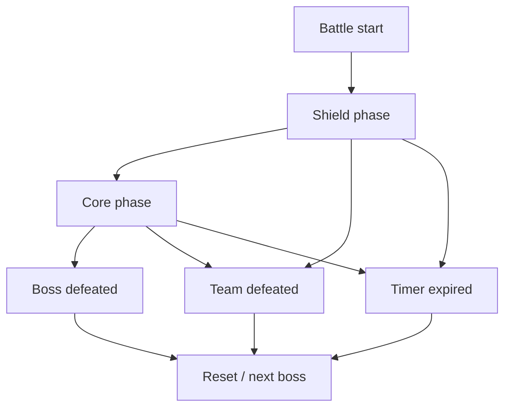

# Combat System

Idle Boss Fighters uses an explicit, state-driven combat flow coordinated by `CombatDirector`.

The combat system is server-side. State transitions and turn order are controlled centrally, while selected mechanics use randomness for target selection, shield formation, and combo activation.

---

## Combat Flow

## CombatDirector

`CombatDirector` is the battle orchestrator. Its responsibilities include:

- shield/core phase selection;
- turn sequencing;
- animation synchronization;
- boss target selection;
- combo resolution;
- timeout handling;
- victory/defeat result creation;
- runtime reset coordination.

The result object explicitly distinguishes:

- `bossDefeated`;
- `teamDefeated`;
- `timeout`.

## CombatSystem and ActionSystem

`CombatSystem` owns combat-oriented calculations and runtime interactions.

`ActionSystem` coordinates presentation-facing execution such as:

- movement;
- animation;
- effects;
- sounds.

This keeps combat flow separate from the details of how an attack is presented.

## Probabilistic Mechanics

The combat sample uses `math.random()` in several places:

- weighted boss targeting;
- shield formation activation;
- dual/triple combo selection.

For that reason, the battle sequence is **not deterministic**. The predictable part is the state machine and result resolution: given the current state and random outcomes, transitions are explicit and bounded.

## Shield Phase

During the shield phase, damage roles attack their corresponding boss shields. The support/tank character can activate a defensive formation, heal the team, and influence boss targeting through an aggro-derived weight.

The phase ends when the boss enters its core state or the battle reaches a terminal condition.

## Core Phase

When the core is vulnerable, the damage characters can execute:

- single attacks;
- dual combos;
- triple combos.

Combo chance overflow is converted into additional combo power after configured probability caps, allowing progression investment to remain useful beyond the activation ceiling.

## Visual Damage Reconciliation

Damage can be applied in several timed visual chunks so the UI and animation feedback feel progressive. At commit time, any remaining residue is applied to preserve the intended total damage amount.

This is a presentation synchronization technique, not a separate damage authority: the server remains the source of the final combat state.

## Timeouts

`RunBattle` tracks elapsed battle time and returns a timeout result when the configured maximum duration is reached.

This provides a bounded exit path for battles that do not reach victory or defeat naturally.

## Design Trade-offs

The combat design favors readability and explicit orchestration over a highly abstract event-driven model.

Strengths:

- clear phase ownership;
- explicit terminal states;
- easy-to-follow turn flow;
- server-side progression authority;
- isolated presentation subsystems.

Trade-offs:

- `CombatDirector` is intentionally central and can grow large;
- animations and combat timing are coupled through wait-based synchronization;
- RNG is not injected as a dependency, so deterministic replay/testing is not built into this version.
