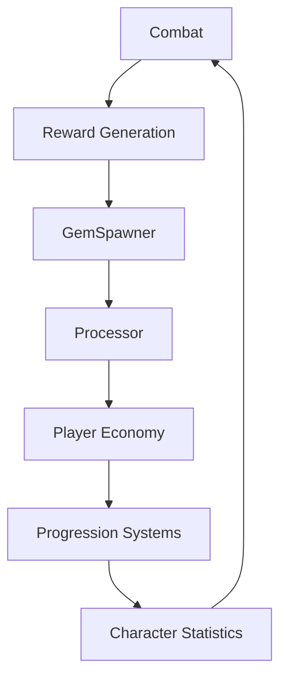
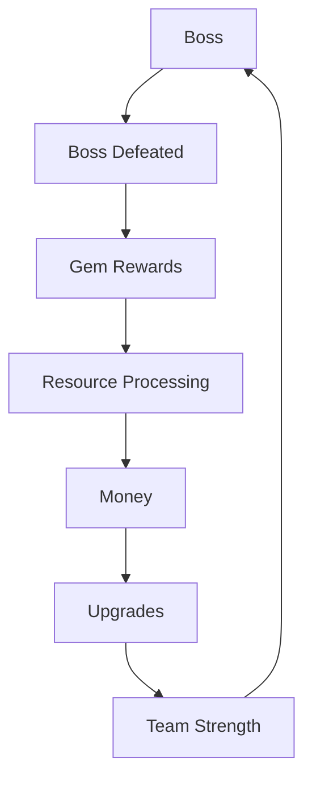

# Economy System

Idle Boss Fighters implements an incremental progression economy designed around resource acquisition, processing, permanent upgrades and indefinite scalability.

The economy is entirely server-authoritative and serves as the primary driver of long-term progression.

---

# System Overview

---

# Progression Loop

Idle Boss Fighters follows a cyclical progression loop.

---

# Economy Principles

The economy follows several design principles.

Examples:

- Permanent progression
- Exponential growth
- Reward feedback
- Continuous engagement
- Infinite scalability

Benefits:

- Long-term retention
- Meaningful progression
- Repeatable gameplay loop
- Incremental satisfaction

---

# GemSpawner

GemSpawner is responsible for reward instantiation.

Responsibilities:

- Generate rewards
- Spawn collectible resources
- Determine quantities
- Coordinate visual representation

Technical Value:

- Reward generation system
- Runtime object management
- Controlled progression pacing

---

# Processor System

The processor acts as an intermediary stage between resource acquisition and permanent progression.

Responsibilities:

- Receive collected resources
- Convert resources into claimable currency
- Apply processing modifiers
- Support automation systems

Technical Value:

- Economy pacing mechanism
- Progression control layer
- Resource transformation system

---

# Upgrade Systems

Progression is achieved through permanent upgrades.

Examples:

- Damage upgrades
- Health upgrades
- Processor upgrades
- Critical systems
- Combo systems
- Efficiency upgrades

Responsibilities:

- Consume player currency
- Increase combat performance
- Scale progression
- Extend gameplay longevity

Technical Value:

- Persistent progression
- Configurable balancing
- Controlled scaling

---

# BigNum Integration

Idle Boss Fighters uses BigNum to support indefinite progression.

Responsibilities:

- Represent large values
- Format numerical output
- Serialize progression state
- Maintain scalability

Examples:

- Damage values
- Currency
- Upgrade costs
- Resource quantities

Technical Value:

- Infinite progression support
- Numerical abstraction
- Economy scalability

---

# Reward Systems

Reward generation occurs through multiple mechanisms.

Examples:

- Boss rewards
- GemSpawner
- ChestSystem
- Multipliers
- Gamepasses
- Boost systems

Responsibilities:

- Increase engagement
- Support monetization
- Encourage progression
- Reward investment

Technical Value:

- Retention mechanics
- Flexible reward architecture
- Scalable reward distribution

---

# Data Integration

Economy systems are persisted through PlayerData.

Stored information includes:

- Currency
- Gems
- Multipliers
- Upgrade levels
- Owned rewards
- Progression statistics

Responsibilities:

- Save progression
- Restore progression
- Maintain economy integrity

Technical Value:

- Persistent economy model
- Reliable progression tracking
- Runtime recovery

---

# Configuration Driven Design

Economy balancing is centralized through Config.

Examples:

- Scaling curves
- Reward values
- Upgrade costs
- Processing rates
- Multipliers

Benefits:

- Easier balancing
- Faster iteration
- Reduced hardcoding
- Improved maintainability

---

# Economy Principles

Idle Boss Fighters follows several economy design principles.

---

## Infinite Progression

Players are never expected to reach a definitive endpoint.

Progression systems are designed to scale indefinitely.

Examples:

- BigNum
- Scaling upgrades
- Reward multipliers

Benefits:

- Extended retention
- Long-term objectives
- Continuous engagement

---

## Server Authority

Economy modifications remain server-side.

Examples:

- Purchases
- Currency changes
- Rewards
- Processing
- Progression

Benefits:

- Economy consistency
- Progression integrity
- Reduced exploitation opportunities

---

## Modularity

Economy systems remain isolated.

Examples:

- GemSpawner
- Processor
- BigNum
- ChestSystem
- Upgrade Systems

Benefits:

- Easier maintenance
- Independent balancing
- Extensible architecture

---

## Feedback Loops

Economy progression continuously reinforces gameplay.

Examples:

Combat

↓

Rewards

↓

Currency

↓

Upgrades

↓

Power

↓

Combat

Benefits:

- Positive reinforcement
- Continuous progression
- Strong retention patterns

---

# Architectural Benefits

The economy architecture provides:

- Infinite scalability
- Configurable balancing
- Persistent progression
- Controlled pacing
- Modular expansion
- Runtime consistency
- Maintainable progression systems
