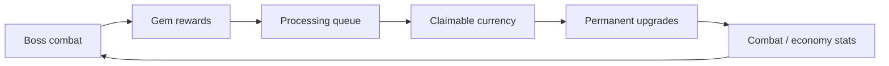

# Economy and Progression

Idle Boss Fighters is built around an incremental economy loop in which combat rewards are converted into permanent progression.

---

## Progression Loop



## Resource Processing

The processor creates an intermediate stage between collecting rewards and receiving spendable currency.

`PlayerData` tracks:

- gems in the backpack;
- gems in the processor;
- the processing queue;
- unclaimed money;
- spendable money.

Processing speed, boosts, gamepasses, and multipliers affect how quickly or efficiently resources move through the loop.

## Upgrade Model

Currency is converted into persistent upgrade counts. Effective levels are derived from configurable step counts and then resolved through stat formulas.

This separates:

```text
raw upgrade purchases
→ effective level
→ configured formula
→ final gameplay stat
```

Cosmetic bonuses and temporary multipliers can then modify the resolved value.

## BigNum

The project uses a custom mantissa/exponent structure for values that exceed ordinary floating-point magnitude:

```text
mantissa × 10^exponent
```

The implementation supports:

- construction from numbers/scientific-notation strings;
- normalization;
- addition and subtraction;
- multiplication and division;
- exponentiation;
- comparisons;
- serialization;
- UI formatting.

### Important numerical boundary

`BigNum` is an **extended-range progression type**, not arbitrary-precision arithmetic.

It stores the mantissa as a normal Roblox number and intentionally ignores additions where exponent distance is large enough to make the smaller value insignificant for the game's purposes.

It is designed primarily for non-negative incremental values such as:

- currency;
- damage;
- health;
- upgrade costs;
- reward quantities.

## Persistence

Economy state is serialized as part of `PlayerData`, including custom `BigNum` values converted to plain `{m, e}` tables.

Deserialization restores missing fields with defaults to maintain compatibility with older profile shapes.

## Offline Progression

When a player returns after being offline, the profile can estimate an offline reward based on:

- elapsed offline time;
- current boss level;
- boss-health scaling;
- reward ratios;
- progression multipliers.

This is an estimate rather than a simulation of every missed battle.

## Data-Driven Balancing

Progression formulas and constants live behind configuration modules rather than being spread throughout the runtime flow.

Typical configuration concerns include:

- boss scaling;
- upgrade costs;
- stat formulas;
- reward ratios;
- processor speeds;
- multiplier values.

## Design Trade-offs

Strengths:

- one consistent large-number abstraction across the economy;
- persistent progression;
- configurable formulas;
- explicit processing stages;
- compatibility defaults for profile evolution.

Trade-offs:

- large exponent gaps sacrifice insignificant precision by design;
- the sample does not provide arbitrary-precision math;
- several gameplay services are referenced but omitted from the portfolio repository;
- balancing remains game-specific rather than a generic economy framework.
