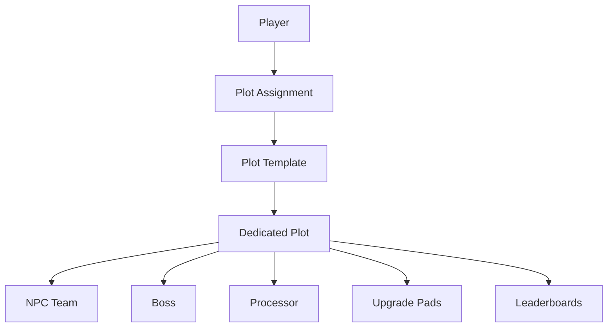

# Plot System

Idle Boss Fighters implements an isolated runtime environment architecture where each player owns an independent gameplay instance.

This approach enables progression isolation, deterministic gameplay behavior and simplified runtime management.

---

# System Overview

---

# Runtime Instancing

Every player receives an isolated gameplay environment.

Each plot contains all systems required for progression.

Examples:

- NPC team
- Boss entity
- Upgrade pads
- Gem spawners
- Processor
- Cosmetic dealers
- Statistics references

Benefits:

- Independent progression
- Reduced synchronization complexity
- Predictable runtime behavior
- Better scalability

---

# Plot Assignment

Plots are dynamically assigned when players enter the experience.

Responsibilities:

- Detect available plots
- Reserve ownership
- Initialize runtime systems
- Connect progression data
- Synchronize player references

Technical Value:

- Runtime ownership model
- Dynamic allocation
- World partitioning

---

# Plot Template

PlotTemplate acts as the blueprint for player environments.

Contained systems include:

- NPC placeholders
- Boss location
- Processor
- Upgrade stations
- Dealer locations
- Spawn points
- Reward areas

Responsibilities:

- Standardize world creation
- Simplify initialization
- Support future expansions

Technical Value:

- Template driven architecture
- Reusable runtime environments
- Reduced initialization complexity

---

# Runtime Ownership

Each plot belongs exclusively to a single player.

Ownership determines:

- Combat authority
- Reward ownership
- Progression state
- NPC references
- Economy references

Benefits:

- Progression isolation
- Clear resource boundaries
- Reduced runtime conflicts

---

# NPC Runtime Management

NPCHandler maintains runtime references for all active entities.

Responsibilities:

- Track NPC state
- Validate NPC existence
- Reposition entities
- Restore invalid positions
- Maintain combat references

Technical Value:

- Runtime entity management
- Fault tolerance
- Recovery systems

---

# Boss Runtime

Boss entities are instantiated inside player plots.

Responsibilities:

- Manage combat lifecycle
- Handle combat states
- Maintain health state
- Coordinate progression
- Trigger rewards

Technical Value:

- Isolated boss instances
- Stateful runtime entities
- Controlled progression

---

# Progression Isolation

Plot architecture guarantees that progression remains independent.

Examples:

- Currency
- Boss level
- NPC upgrades
- Cosmetics
- Quest progress
- Rewards

Benefits:

- Consistent progression
- Simplified persistence
- Predictable save behavior

---

# Runtime Synchronization

Gameplay systems synchronize through player ownership.

Examples:

Combat

↓

Rewards

↓

Economy

↓

Progression

↓

Plot State

Responsibilities:

- Maintain consistency
- Coordinate gameplay systems
- Update world entities
- Reflect progression changes

---

# Fault Tolerance

Runtime validation mechanisms exist to recover from anomalies.

Examples:

- SafeZone
- NPC recovery
- Position validation
- Entity restoration

Benefits:

- Runtime stability
- Reduced gameplay interruptions
- Improved reliability

---

# Architectural Principles

Idle Boss Fighters follows several world management principles.

---

## World Isolation

Each player owns an independent environment.

Benefits:

- Reduced complexity
- Improved scalability
- Easier maintenance

---

## Ownership Boundaries

Resources belong to explicit owners.

Examples:

- Rewards
- NPCs
- Bosses
- Progression state

Benefits:

- Clear system responsibilities
- Easier debugging
- Reduced conflicts

---

## Template Driven Design

Plots are generated from predefined structures.

Benefits:

- Reusability
- Standardization
- Faster iteration

---

## Runtime Validation

Entities are continuously monitored.

Examples:

- NPC validation
- Recovery systems
- Position checks

Benefits:

- Fault tolerance
- Runtime consistency
- Improved stability

---

# Architectural Benefits

The plot architecture provides:

- Runtime isolation
- Ownership clarity
- Simplified persistence
- Improved scalability
- Reduced synchronization issues
- Reusable environments
- Better maintainability
