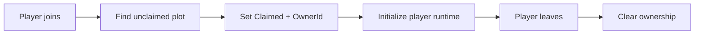

# Plot and Runtime Ownership

Idle Boss Fighters uses a fixed set of Roblox plots to isolate each player's runtime references inside a shared server.

This is a per-player ownership model, not separate server instancing.

---

## Allocation Flow



## PlotManager

`PlotManager.AssignPlot` iterates through `workspace.Plots` and assigns the first unclaimed plot.

Ownership is stored using attributes:

- `Claimed`;
- `OwnerId`.

The same manager provides:

- player → plot lookup;
- part → plot resolution;
- spawn lookup;
- ownership release.

## Why Explicit Ownership Helps

Many systems need to answer the same question:

```text
Which player owns this runtime object?
```

Using the plot as an ownership boundary simplifies:

- reward routing;
- NPC/boss references;
- interaction checks;
- progression scope;
- cleanup when a player leaves.

## Runtime Contents

A player plot can contain references such as:

- NPC team;
- boss;
- processor;
- upgrade pads;
- gem/reward objects;
- dealers;
- spawn points;
- local display/leaderboard objects.

The portfolio sample focuses on ownership and lookup rather than plot construction.

## Capacity Boundary

Because plots are preconfigured and assigned from a finite folder, concurrent capacity per Roblox server is bounded by the number of available plots.

This is an intentional and important architectural constraint. The model simplifies ownership but does not dynamically create unlimited runtime environments.

## Runtime Recovery

The project contains two targeted recovery mechanisms:

### Missing entity guard

`GameManager` periodically checks required NPC and boss references. Missing entities can be reconstructed from their domain builders and current player progression state.

### SafeZone

`SafeZone` checks the distance between active models and known default positions. Models that leave the allowed radius are:

- moved back to a recovery position;
- stripped of accumulated linear/angular velocity;
- returned from `PlatformStand`;
- unanchored where required.

These mechanisms address common physics/runtime anomalies inside a plot.

## Design Trade-offs

Strengths:

- explicit ownership boundary;
- simple player/resource lookup;
- reduced cross-player reference ambiguity;
- predictable cleanup;
- recovery can remain scoped to one player's runtime.

Trade-offs:

- fixed plot count limits concurrency;
- linear plot scans are simple but not optimized for very large plot sets;
- recovery loops poll on intervals rather than reacting to a central health/event system;
- all plots still share one Roblox server process.
